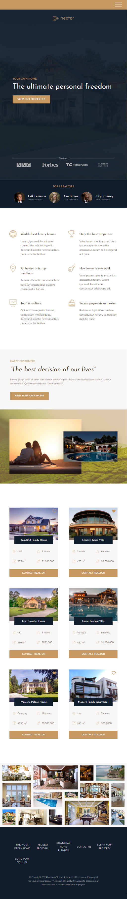

# Nexter Landing Page (HTML, Scss/CSS Grid)

Responsive landing page for a luxury realtor agency. Main goal of the project was to build a responsive layout using CSS grid.

[Live demo of the project](https://nexter-snowy.vercel.app/).

## Features

- CSS Grid and Flexbox layout
- Responsive grid design for various screen sizes
- Scss files structure and BEM class naming

## How to run locally

To run the project on your computer:

1. Clone the repository:

   ```bash
   git clone git@github.com:mker/nexter.git
   cd nexter
   ```

2. Install dependencies:

   ```bash
   npm install
   ```

3. Compile SCSS to CSS:

   ```bash
   npm run build:css
   ```

4. Launches the dev server (VSCode), watches for changes in SCSS files and compiles them:

```bash
npm run start
```

## Preview

| Desktop Screens                             | Tablet & Mobile Screens                     |
|:-------------------------------------------:|:-------------------------------------------:|
|          |    |


## Credits

This project was built as part of the [Jonas Schmedtmann's Advanced CSS and Sass course](https://www.udemy.com/course/advanced-css-and-sass/).

